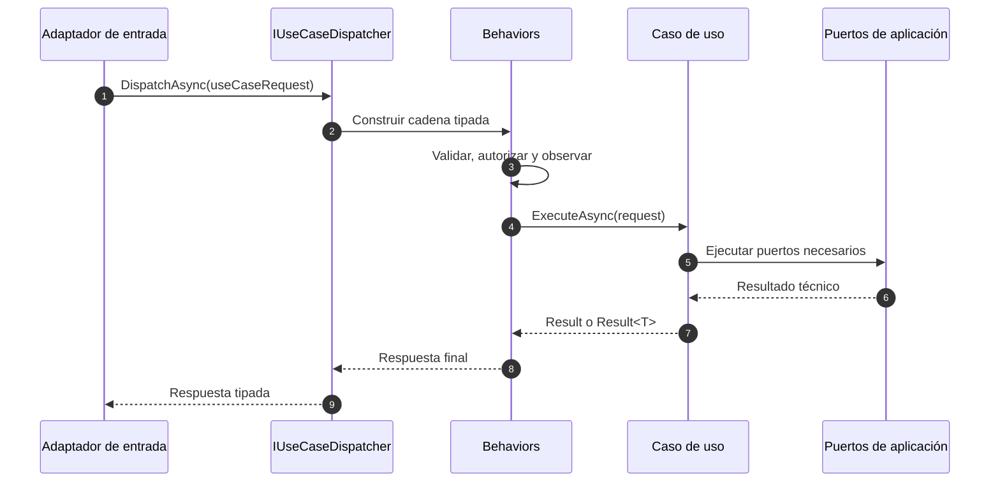
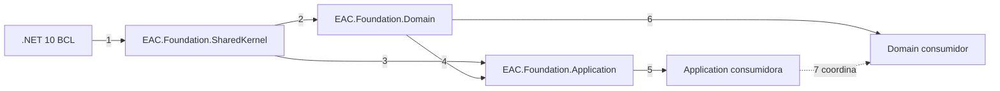

# Diseño de Application dentro de EAC.Foundation

> **Orden documental:** DOC-025 · **Etapa:** Foundation · [Índice maestro](../INDICE_DOCUMENTAL.md)

> Tercer paquete diseñado durante F3. Define contratos para casos de uso CQRS locales; no implementa transporte, persistencia ni composición del host.

## 1. Propósito

`EAC.Foundation.Application` proporciona contratos mínimos para Commands, Queries, casos de uso, despacho local, behaviors, validación, paginación y puertos reutilizables de persistencia.

El paquete permite aplicar CQRS dentro de un único componente físico. CQRS separa modelos y flujos de lectura y escritura, pero no obliga a utilizar procesos, bases de datos ni brokers diferentes.

## 2. Identidad

| Propiedad | Decisión |
|---|---|
| Package ID | `EAC.Foundation` |
| Target framework | `net10.0` |
| Nullable | habilitado |
| Dependencia `EAC.*` | ninguna; SharedKernel pertenece al mismo ensamblado |
| Dependencias externas | ninguna |
| Dependencia de Domain | contratos mínimos del mismo ensamblado `EAC.Foundation` |
| Compatibilidad | SemVer |
| AOT y trimming | debe ser compatible |

## 3. Responsabilidades

El paquete contiene:

- contratos base de request y caso de uso;
- Commands y Queries tipados;
- dispatcher local abstracto;
- contrato de pipeline behavior;
- validadores y fallos de validación;
- request y resultado de paginación inmutables;
- contratos base opcionales de Repository, Unit of Work y QueryService.

El paquete no contiene:

- descubrimiento o registro por reflexión;
- contenedor de inyección de dependencias;
- acceso a Entity Framework Core;
- implementaciones de Repository, Unit of Work o QueryService;
- transacciones automáticas;
- publicación Kafka o envío remoto de Commands;
- endpoints, documentos JSON:API o códigos HTTP;
- serialización;
- modelos de dominio o DTO concretos;
- una dependencia obligatoria de `EAC.Foundation.Domain`.

## 4. Modelo de ejecución

Toda entrada de caso de uso se representa como `IUseCaseRequest<TUseCaseResponse>`. El tipo de respuesta completo forma parte del contrato y normalmente será `Result` o `Result<TValue>`.

```text
Command sin valor  -> IUseCaseRequest<Result>
Command con valor  -> IUseCaseRequest<Result<TValue>>
Query con valor    -> IUseCaseRequest<Result<TValue>>
```

Esto permite que el dispatcher y los behaviors sean genéricos sin conversiones dinámicas del resultado.

## 5. API pública implementada

### 5.1 Request y caso de uso base

```csharp
namespace EAC.Foundation.Application.Requests;

public interface IUseCaseRequest<TUseCaseResponse>
{
}

public interface IUseCase<TUseCaseRequest, TUseCaseResponse>
    where TUseCaseRequest : IUseCaseRequest<TUseCaseResponse>
{
    Task<TUseCaseResponse> ExecuteAsync(
        TUseCaseRequest useCaseRequest,
        CancellationToken cancellationToken = default);
}
```

Reglas:

- todo request declara estáticamente su respuesta;
- el caso de uso implementa una única capacidad de aplicación;
- `CancellationToken` se propaga a todas las dependencias;
- un caso de uso no se utiliza como contrato de transporte.

### 5.2 Commands

```csharp
using EAC.Foundation.SharedKernel.Results;

namespace EAC.Foundation.Application.Commands;

public interface ICommand : IUseCaseRequest<Result>
{
}

public interface ICommand<TValue> : IUseCaseRequest<Result<TValue>>
{
}

public interface ICommandUseCase<TCommand> :
    IUseCase<TCommand, Result>
    where TCommand : ICommand
{
}

public interface ICommandUseCase<TCommand, TValue> :
    IUseCase<TCommand, Result<TValue>>
    where TCommand : ICommand<TValue>
{
}
```

Un Command expresa intención de cambio. No contiene metadata de broker, destino, retry o serialización.

### 5.3 Queries

```csharp
using EAC.Foundation.SharedKernel.Results;

namespace EAC.Foundation.Application.Queries;

public interface IQuery<TValue> : IUseCaseRequest<Result<TValue>>
{
}

public interface IQueryUseCase<TQuery, TValue> :
    IUseCase<TQuery, Result<TValue>>
    where TQuery : IQuery<TValue>
{
}
```

Toda Query devuelve un valor tipado. Una consulta sin resultado se considera un contrato mal definido y no dispone de interfaz específica.

### 5.4 Dispatcher local

```csharp
namespace EAC.Foundation.Application.Dispatching;

public interface IUseCaseDispatcher
{
    Task<TUseCaseResponse> DispatchAsync<TUseCaseResponse>(
        IUseCaseRequest<TUseCaseResponse> useCaseRequest,
        CancellationToken cancellationToken = default);
}
```

Reglas:

- despacha únicamente dentro del proceso;
- resuelve exactamente un caso de uso;
- la ausencia o duplicidad de un caso de uso es un error de configuración;
- no publica en Kafka ni crea mensajes Outbox;
- su implementación pertenece a `EAC.Application.Runtime`; Hosting solamente gobierna el proceso.

### 5.5 Pipeline behavior

```csharp
namespace EAC.Foundation.Application.Pipeline;

public delegate Task<TUseCaseResponse> UseCaseContinuation<TUseCaseResponse>(
    CancellationToken cancellationToken);

public interface IPipelineBehavior<TUseCaseRequest, TUseCaseResponse>
    where TUseCaseRequest : IUseCaseRequest<TUseCaseResponse>
{
    Task<TUseCaseResponse> ExecuteAsync(
        TUseCaseRequest useCaseRequest,
        UseCaseContinuation<TUseCaseResponse> continuation,
        CancellationToken cancellationToken = default);
}
```

Usos previstos:

- validación;
- observabilidad;
- autorización de aplicación;
- idempotencia de Commands;
- transacción local mediante un adaptador de persistencia.

El paquete define el contrato, pero no instala behaviors automáticamente.

### 5.6 Validación

```csharp
namespace EAC.Foundation.Application.Validation;

public sealed record ValidationFailure
{
    public ValidationFailure(string field, string code, string message);

    public string Field { get; }
    public string Code { get; }
    public string Message { get; }
}

public sealed record ValidationError : IError
{
    public ValidationError(
        string code,
        string description,
        IReadOnlyCollection<ValidationFailure> failures);

    public string Code { get; }
    public string Description { get; }
    public ErrorType Type { get; }
    public IReadOnlyCollection<ValidationFailure> Failures { get; }
}

public sealed class ValidationOutcome
{
    public bool IsValid { get; }
    public IReadOnlyCollection<ValidationFailure> Failures { get; }

    public static ValidationOutcome Valid();
    public static ValidationOutcome Invalid(
        IEnumerable<ValidationFailure> failures);
}

public interface IUseCaseRequestValidator<in TUseCaseRequest>
{
    ValueTask<ValidationOutcome> ValidateAsync(
        TUseCaseRequest useCaseRequest,
        CancellationToken cancellationToken = default);
}
```

Reglas:

- `Field` puede estar vacío para errores que afectan al request completo;
- `Code` es estable y no localizado;
- `Message` es seguro para el consumidor;
- el orden de fallos se conserva;
- `ValidationError` exige al menos un fallo y toma un snapshot inmutable de la colección;
- `Invalid` requiere al menos un fallo;
- una librería externa de validación podrá integrarse mediante adaptador, sin filtrarse en la API pública.

El behavior de validación del runtime convierte un `ValidationOutcome` inválido en un `Result` fallido que contiene `ValidationError`. `Error` permanece sellado y sin metadata libre; la especialización se realiza mediante `IError`.

### 5.7 Paginación

```csharp
namespace EAC.Foundation.Application.Pagination;

public sealed record PageRequest
{
    public int Number { get; }
    public int Size { get; }

    public PageRequest(int number, int size);
}

public sealed class Page<TItem>
{
    public IReadOnlyList<TItem> Items { get; }
    public int Number { get; }
    public int Size { get; }
    public long TotalItems { get; }
    public int TotalPages { get; }
    public bool HasPrevious { get; }
    public bool HasNext { get; }

    public Page(
        IEnumerable<TItem> items,
        int number,
        int size,
        long totalItems);

}
```

Invariantes:

- `Number` comienza en 1;
- `Size` es mayor que cero;
- el máximo permitido se aplica en el borde de cada aplicación;
- `TotalItems` no puede ser negativo;
- `Items` es inmutable para el consumidor;
- `Items.Count` no puede superar `Size` ni `TotalItems`;
- `TotalPages` se calcula de forma segura;
- si el número exacto de páginas supera `int.MaxValue`, se rechaza el total en lugar de saturarlo o desbordarlo; `PageRequest.Number` utiliza el mismo rango `int`;
- una página vacía se representa mediante el mismo constructor, sin factory estático redundante;
- la paginación no expone `IQueryable`, cursores de base de datos ni tipos HTTP.

### 5.8 Puertos de persistencia

Las abstracciones base reducen repetición, pero no intentan homogeneizar todos los motores:

> **Lineamiento CQRS:** Repository pertenece exclusivamente al Command Side y solo maneja Aggregate Roots. Toda consulta funcional pertenece al Query Side y se implementa mediante QueryService, incluso cuando busca por identificador.

```csharp
using EAC.Foundation.Domain;

namespace EAC.Foundation.Application.Persistence;

public interface IRepository<TAggregate, in TId>
    where TAggregate : class, IAggregateRoot, IEntity<TId>
    where TId : notnull
{
    Task<TAggregate?> FindAsync(
        TId id,
        CancellationToken cancellationToken = default);

    ValueTask AddAsync(
        TAggregate aggregate,
        CancellationToken cancellationToken = default);

    void Remove(TAggregate aggregate);
}

public interface IUnitOfWork
{
    Task<CommitResult> CommitAsync(
        CancellationToken cancellationToken = default);
}

public readonly record struct CommitResult
{
    public CommitResult(int affectedEntries)
    {
        ArgumentOutOfRangeException.ThrowIfNegative(affectedEntries);
        AffectedEntries = affectedEntries;
    }

    public int AffectedEntries { get; }
}
```

El servicio puede especializar ambos contratos:

```csharp
public interface IOrderRepository : IRepository<Order, OrderId>
{
}

public interface IOrderUnitOfWork : IUnitOfWork
{
    IOrderRepository Orders { get; }
}
```

`IUnitOfWork` representa la confirmación de una unidad local. `Begin`, `CommitTransaction`, `Rollback`, `Migrate` y `EnsureCreated` no forman parte del puerto de Application: son detalles operativos del adaptador y del pipeline.

El lado de lectura utiliza QueryServices separados de los repositorios de agregados:

```csharp
public interface IQueryService<TReadModel, in TId>
    where TId : notnull
{
    Task<TReadModel?> FindAsync(
        TId id,
        CancellationToken cancellationToken = default);

    Task<bool> ExistsAsync(
        TId id,
        CancellationToken cancellationToken = default);
}

public interface IOrderQueryService
    : IQueryService<OrderSummary, OrderId>
{
    Task<Page<OrderSummary>> SearchAsync(
        OrderSearchCriteria criteria,
        PageRequest page,
        CancellationToken cancellationToken = default);
}
```

Reglas:

- Repository trabaja exclusivamente con Aggregate Roots y el Command Store;
- el contrato base exige en compilación que el agregado implemente `IAggregateRoot` e `IEntity<TId>`;
- `Repository.FindAsync` solo rehidrata un agregado para ejecutar un Command; no atiende Queries ni devuelve DTO;
- QueryService atiende todas las Queries y devuelve read models o proyecciones;
- una Query por identificador también usa QueryService;
- ninguna entidad hija tiene Repository propio salvo que sea Aggregate Root;
- las consultas específicas se expresan con criterios de Application;
- no se exponen `IQueryable`, `DbSet`, `IMongoCollection` ni sesiones;
- `GetAll` sin límite no forma parte del contrato base;
- `CommitResult` rechaza conteos negativos y representa únicamente el resultado de una confirmación local;
- `IUnitOfWork` solo se usa cuando el proveedor dispone de una unidad local equivalente; no simula transacciones distribuidas;
- las implementaciones genéricas pertenecen al adaptador `EAC.Infrastructure.Persistence.*` de su familia tecnológica;
- un servicio puede omitir estas bases cuando su tecnología requiera un puerto más específico.

## 6. Ejemplo de Command

```csharp
public readonly record struct DocumentId(Guid Value);

public sealed record PublishDocumentCommand(Guid DocumentId) :
    ICommand<DocumentId>;

public sealed class PublishDocumentUseCase :
    ICommandUseCase<PublishDocumentCommand, DocumentId>
{
    public Task<Result<DocumentId>> ExecuteAsync(
        PublishDocumentCommand command,
        CancellationToken cancellationToken = default)
    {
        // Cargar agregado, ejecutar dominio y persistir mediante puertos locales.
        return Task.FromResult(
            Result<DocumentId>.Success(new DocumentId(command.DocumentId)));
    }
}
```

## 7. Ejemplo de Query

```csharp
public sealed record SearchDocumentsQuery(
    PageRequest Page) : IQuery<Page<DocumentSummary>>;

public sealed class SearchDocumentsUseCase :
    IQueryUseCase<SearchDocumentsQuery, Page<DocumentSummary>>
{
    public Task<Result<Page<DocumentSummary>>> ExecuteAsync(
        SearchDocumentsQuery query,
        CancellationToken cancellationToken = default)
    {
        // Consultar un puerto de lectura definido por la aplicación.
        throw new NotImplementedException();
    }
}
```

Los ejemplos ilustran contratos y no incorporan tipos del dominio asegurador en EAC Foundation.

## 8. Flujo de ejecución local



### Orden explicado

1. Un adaptador HTTP, worker o consumidor traduce su entrada a Command o Query.
2. El dispatcher construye el pipeline correspondiente al tipo concreto.
3. Los behaviors ejecutan responsabilidades transversales en orden explícito.
4. El último delegado invoca exactamente un caso de uso.
5. El caso de uso coordina dominio y puertos definidos por la aplicación.
6. Los puertos devuelven información técnica sin introducir transporte en el caso de uso.
7. El caso de uso devuelve un resultado explícito.
8. Los behaviors completan su ejecución en orden inverso.
9. El dispatcher devuelve el tipo declarado al adaptador.

## 9. Orden recomendado de behaviors

```text
1. Correlation y observabilidad
2. Autorización de aplicación
3. Validación
4. Idempotencia, solo Commands configurados
5. Transacción local, solo Commands configurados
6. Caso de uso
```

El orden es configuración del host y debe quedar visible. No se activa una transacción para Queries ni se aplica retry automático a Commands no idempotentes.

## 10. Decisiones de diseño

| Elemento | Decisión | Regla |
|---|---|---|
| `IUseCaseRequest<TUseCaseResponse>` | incluir | entrada y respuesta de caso de uso para despacho estático |
| `ICommand` | incluir | declarar `Result` como respuesta completa |
| `IQuery<TValue>` | incluir | toda Query declara valor de respuesta |
| casos de uso | incluir | utilizar `ICommandUseCase` e `IQueryUseCase` |
| resultados | explícitos | utilizar `Result`, `Result<T>` y DTO tipado |
| Command sin valor | incluir | devuelve `Result` para representar fallo esperado |
| dispatcher local | incluir | no transporta Commands remotos |
| observabilidad | extensión | implementar mediante `IPipelineBehavior` desde Observability |
| paginación | inmutable | utilizar `Page<T>` y `PageRequest` |
| DTO de lectura | explícito | no requiere interfaz marcadora |
| puertos de datos | propiedad del consumidor | cada aplicación define contratos orientados a casos de uso |

## 11. Estructura del proyecto

```text
src/
└── EAC.Foundation/
    ├── Application/
    │   ├── Commands/
    │   │   ├── ICommand.cs
    │   │   └── ICommandUseCase.cs
    │   ├── Dispatching/
    │   │   └── IUseCaseDispatcher.cs
    │   ├── Pagination/
    │   │   ├── Page.cs
    │   │   └── PageRequest.cs
    │   ├── Persistence/
    │   │   ├── CommitResult.cs
    │   │   ├── IRepository.cs
    │   │   ├── IQueryService.cs
    │   │   └── IUnitOfWork.cs
    │   ├── Pipeline/
    │   │   ├── IPipelineBehavior.cs
    │   │   └── UseCaseContinuation.cs
    │   ├── Queries/
    │   │   ├── IQuery.cs
    │   │   └── IQueryUseCase.cs
    │   ├── Requests/
    │   │   ├── IUseCase.cs
    │   │   └── IUseCaseRequest.cs
    │   └── Validation/
    │       ├── IUseCaseRequestValidator.cs
    │       ├── ValidationError.cs
    │       ├── ValidationFailure.cs
    │       └── ValidationOutcome.cs
    └── EAC.Foundation.csproj
```

Este es un único proyecto, ensamblado y NuGet `EAC.Foundation`. En `alpha.17` existen Commands, Dispatching, Pagination, Persistence, Pipeline, Queries, Requests y Validation. Las implementaciones para EF Core, MongoDB y Marten no se ubican aquí: pertenecen a sus adaptadores `EAC.Infrastructure.Persistence.*`.

## 12. Grafo de dependencias



### Orden explicado

1. Shared Kernel depende únicamente de la BCL.
2. Domain utiliza los eventos mínimos de Shared Kernel.
3. Application utiliza `Result`, `IError` y sus contratos de Shared Kernel.
4. `IRepository<TAggregate, TId>` utiliza `IAggregateRoot` e `IEntity<TId>` del namespace Domain del mismo ensamblado para restringir el Command Side en compilación.
5. La capa Application de un servicio implementa Commands, Queries y casos de uso.
6. El dominio consumidor puede utilizar opcionalmente las bases de Foundation.Domain.
7. Los casos de uso coordinan el dominio concreto del servicio sin introducir dependencias hacia infraestructura o transporte.

## 13. Compatibilidad

Son cambios incompatibles:

- modificar la respuesta declarada por Command o Query;
- cambiar las restricciones genéricas de casos de uso o behaviors;
- renombrar `ExecuteAsync` o `DispatchAsync`;
- cambiar la semántica de cancelación;
- alterar la base 1 de `PageRequest.Number`;
- hacer mutable `Page<T>`;
- introducir dependencias externas en firmas públicas;
- convertir el dispatcher local en transporte remoto.

## 14. Pruebas requeridas

### Contratos CQRS

- Commands y Queries declaran la respuesta correcta;
- solo un caso de uso puede resolver cada request;
- cancelación se propaga;
- el dispatcher devuelve el tipo exacto;
- ausencia y duplicidad de caso de uso fallan de manera determinista.

### Pipeline

- behaviors respetan el orden configurado;
- `continuation` se ejecuta como máximo una vez;
- un behavior puede detener la cadena con un resultado fallido;
- excepción y cancelación no se convierten silenciosamente en éxito.

### Validación

- resultado válido no contiene fallos;
- resultado inválido requiere fallos;
- se preservan código, campo, mensaje y orden;
- se respeta cancelación.

### Paginación

- valida número, tamaño y total;
- calcula páginas y navegación;
- soporta total mayor que `int.MaxValue`;
- no permite modificar Items;
- representa una página vacía.

### Persistencia

- Repository solo admite Aggregate Roots identificados;
- QueryService permanece separado de Repository y Unit of Work;
- `CommitResult` rechaza conteos negativos;
- cancelación se conserva en operaciones asíncronas;
- las firmas no exponen `IQueryable`, drivers, sesiones ni tipos de transporte.

### Arquitectura

- referencia únicamente namespaces del mismo `EAC.Foundation` y BCL;
- no referencia infraestructura;
- snapshot de API pública;
- build Release con analizadores de trimming/AOT, snapshot público y paquete determinista para `net10.0`.

## 15. Criterios de aceptación

El diseño se considera cerrado cuando:

- Commands y Queries tienen resultados estáticos y explícitos;
- los casos de uso no dependen de transporte o persistencia;
- dispatcher local y mensajería remota son conceptos separados;
- behaviors permiten capacidades transversales sin acoplar el paquete;
- paginación y validación son inmutables;
- Application solo utiliza SharedKernel, los contratos mínimos de Domain del mismo ensamblado y BCL;
- Repository, Unit of Work y QueryService son puertos sin detalles de provider;
- las pruebas arquitectónicas impiden usar Repository desde un Query Use Case;
- cada contrato público tiene pruebas definidas.

## 16. Decisiones aplazadas

Se diseñarán con sus paquetes propietarios:

- implementación del dispatcher y composición de behaviors: `EAC.Application.Runtime`;
- behavior de observabilidad: Observability;
- implementaciones de Repository, Unit of Work y QueryService: Persistence;
- behavior transaccional y recolección de eventos: Persistence;
- behavior de idempotencia: Persistence/Inbox;
- adaptador para librerías de validación: Validation;
- traducción de errores a error objects: `EAC.Infrastructure.Api.JsonApi`;
- Commands remotos: Messaging.

## 17. Estado de implementación

PF-004 está validado en `0.1.0-alpha.17`. `alpha.6..10` estableció CQRS, Use Cases, dispatcher y pipeline; `alpha.11..13` completó Validation, `alpha.14..15` Paginación y `alpha.16` los puertos de persistencia. `alpha.17` cierra la trazabilidad de `EAC-CONF-APP-001..012`, con `APP-002` delegado explícitamente a Runtime por ser propietario de la composición. La evidencia es build Release sin advertencias y 177 pruebas aprobadas.

La [auditoría de cierre de Application](https://github.com/eac-architecture/eac-foundation/blob/main/docs/governance/AUDITORIA_CIERRE_APPLICATION.md) aprueba PF-004 y autoriza PF-005 sin añadir otra librería ni ensamblado.

El estado, la dependencia y las evidencias se mantienen en el [plan de implementación de Platform](https://github.com/eac-architecture/eac-architecture-docs/blob/main/docs/planning/PLAN_DE_IMPLEMENTACION_DE_PLATAFORMA.md).
