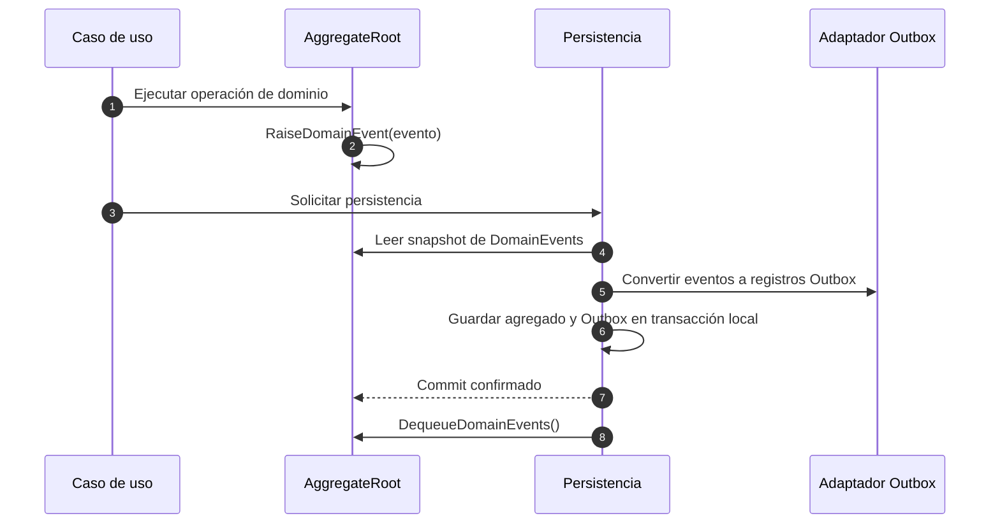
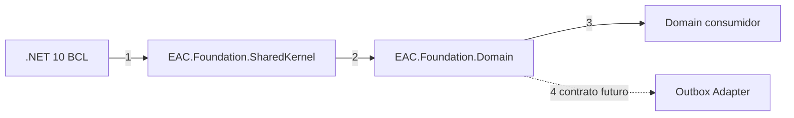

# Diseño de Domain dentro de EAC.Foundation

> **Orden documental:** DOC-024 · **Etapa:** Foundation · [Índice maestro](../INDICE_DOCUMENTAL.md)

> Segundo paquete diseñado durante F3. Proporciona ayudas opcionales para modelado DDD sin introducir persistencia, transporte ni reglas de una solución consumidora.

## 1. Propósito

`EAC.Foundation.Domain` ofrece implementaciones reutilizables de entidad, agregado y value object, además del contrato para acumular eventos de dominio.

El uso del paquete es opcional. Una solución puede implementar su modelo de dominio sin heredar de estas clases, siempre que respete los contratos necesarios para las capacidades que decida consumir.

## 2. Identidad

| Propiedad | Decisión |
|---|---|
| Package ID | `EAC.Foundation` |
| Target framework | `net10.0` |
| Nullable | habilitado |
| Dependencia `EAC.*` | ninguna; SharedKernel pertenece al mismo ensamblado |
| Dependencias externas | ninguna |
| Compatibilidad | SemVer |
| AOT y trimming | debe ser compatible |

## 3. Responsabilidades

El paquete contiene:

- identidad y reglas de igualdad para entidades;
- marcador de raíz de agregado;
- acumulación y extracción atómica de eventos de dominio;
- implementación opcional de igualdad estructural para value objects.

El paquete no contiene:

- repositorios, Unit of Work o `DbContext`;
- anotaciones o configuraciones de Entity Framework Core;
- Commands, Queries o casos de uso;
- serialización o envelopes de integración;
- Outbox, Inbox o publicación de eventos;
- auditoría, soft delete o multi-tenancy implícitos;
- lógica de negocio compartida;
- generación de identificadores o acceso al reloj.

## 4. API pública propuesta

### 4.1 IEntity

```csharp
namespace EAC.Foundation.Domain;

public interface IEntity<out TId>
    where TId : notnull
{
    TId Id { get; }
}
```

La interfaz expresa identidad sin imponer persistencia ni mutabilidad.

### 4.2 Entity

```csharp
namespace EAC.Foundation.Domain;

public abstract class Entity<TId> : IEntity<TId>, IEquatable<Entity<TId>>
    where TId : notnull
{
    public TId Id { get; protected set; }
    public bool IsTransient { get; }

    protected Entity(TId id);
    protected Entity();

    public bool Equals(Entity<TId>? other);
    public override bool Equals(object? obj);
    public override int GetHashCode();

    public static bool operator ==(Entity<TId>? left, Entity<TId>? right);
    public static bool operator !=(Entity<TId>? left, Entity<TId>? right);
}
```

Invariantes de igualdad:

- dos referencias al mismo objeto son iguales;
- entidades de tipos concretos diferentes nunca son iguales aunque compartan identificador;
- dos entidades persistentes del mismo tipo son iguales cuando sus identificadores son iguales;
- dos entidades transitorias distintas nunca son iguales;
- `IsTransient` compara `Id` con `default(TId)` sin reglas especiales para `Guid`, `int` u otros tipos;
- el hash de una entidad persistente se basa en tipo concreto e identificador;
- el constructor sin parámetros existe únicamente para materializadores y queda `protected`.

El paquete no valida que un identificador sea funcionalmente correcto. Cada tipo de identificador o agregado aplica sus propias invariantes.

### 4.3 IAggregateRoot

```csharp
namespace EAC.Foundation.Domain;

public interface IAggregateRoot
{
}
```

Es un marcador para expresar límites de consistencia. No contiene callbacks de persistencia como `OnDeleting()`.

### 4.4 IHasDomainEvents

```csharp
using EAC.Foundation.SharedKernel.Domain;

namespace EAC.Foundation.Domain;

public interface IHasDomainEvents
{
    IReadOnlyCollection<IDomainEvent> DomainEvents { get; }

    IReadOnlyCollection<IDomainEvent> DequeueDomainEvents();
}
```

Reglas:

- `DomainEvents` presenta una vista de solo lectura;
- `DequeueDomainEvents()` devuelve un snapshot y limpia la colección en una sola operación lógica;
- un consumidor no puede agregar o eliminar eventos directamente;
- los adaptadores Outbox trabajan contra esta interfaz, nunca contra `AggregateRoot<Guid>`;
- el orden de los eventos se conserva.

### 4.5 AggregateRoot

```csharp
using EAC.Foundation.SharedKernel.Domain;

namespace EAC.Foundation.Domain;

public abstract class AggregateRoot<TId> :
    Entity<TId>,
    IAggregateRoot,
    IHasDomainEvents
    where TId : notnull
{
    public IReadOnlyCollection<IDomainEvent> DomainEvents { get; }

    protected AggregateRoot(TId id);
    protected AggregateRoot();

    protected void RaiseDomainEvent(IDomainEvent domainEvent);
    public IReadOnlyCollection<IDomainEvent> DequeueDomainEvents();
}
```

Invariantes:

- `RaiseDomainEvent` rechaza `null`;
- el agregado no publica ni serializa eventos;
- eliminar un agregado requiere invocar explícitamente una operación de dominio que produzca el evento correspondiente;
- no se genera automáticamente un evento observando estados de EF Core;
- extraer eventos no altera el estado funcional del agregado.

### 4.6 ValueObject

```csharp
namespace EAC.Foundation.Domain;

public abstract class ValueObject : IEquatable<ValueObject>
{
    protected abstract IEnumerable<object?> GetEqualityComponents();

    public bool Equals(ValueObject? other);
    public override bool Equals(object? obj);
    public override int GetHashCode();

    public static bool operator ==(ValueObject? left, ValueObject? right);
    public static bool operator !=(ValueObject? left, ValueObject? right);
}
```

Reglas:

- compara únicamente instancias del mismo tipo concreto;
- la igualdad utiliza componentes ordenados e inmutables;
- las clases derivadas no exponen setters que rompan el hash;
- se recomienda utilizar `record` o `readonly record struct` cuando resuelvan el caso sin clase base.

## 5. Ejemplo de consumo

```csharp
public readonly record struct DocumentId(Guid Value);

public sealed record DocumentPublished(
    Guid EventId,
    DateTimeOffset OccurredAtUtc,
    DocumentId DocumentId) : IDomainEvent;

public sealed class Document : AggregateRoot<DocumentId>
{
    private Document()
    {
    }

    public Document(DocumentId id) : base(id)
    {
    }

    public void Publish(Guid eventId, DateTimeOffset occurredAtUtc)
    {
        // Validar invariantes y cambiar estado.
        RaiseDomainEvent(new DocumentPublished(eventId, occurredAtUtc, Id));
    }
}
```

El agregado recibe tiempo e identificadores desde el caso de uso. El paquete de dominio no usa directamente `DateTimeOffset.UtcNow` ni `Guid.NewGuid()`.

## 6. Integración futura con Outbox



### Orden explicado

1. El caso de uso invoca una operación explícita del agregado.
2. El agregado valida invariantes, cambia estado y acumula el evento.
3. Application solicita persistir la unidad de trabajo.
4. El adaptador lee un snapshot de `DomainEvents` mediante `IHasDomainEvents`, sin limpiar todavía la colección ni asumir el tipo del identificador.
5. Outbox crea su envelope y metadata sin modificar el evento de dominio.
6. Persistencia guarda cambios y mensajes Outbox en la misma transacción local.
7. Solo después de confirmar el commit se invoca `DequeueDomainEvents()` para limpiar los eventos procesados.

Si el commit falla, no se invoca `DequeueDomainEvents()` y se descarta o reintenta la unidad completa según la política transaccional. El objetivo es evitar pérdida de eventos, reflexión sobre nombres de propiedades, conversión forzada a `Guid` y dependencia del adaptador respecto de la clase concreta.

## 7. Decisiones de diseño

| Elemento | Decisión | Regla |
|---|---|---|
| `IEntity<TId>` | incluir | contrato de identidad libre de persistencia |
| `Entity<TId>` | incluir | igualdad por tipo concreto, identidad y operadores consistentes |
| `IAggregateRoot` | incluir | marcador sin callbacks de persistencia |
| `AggregateRoot<TId>` | incluir | acumulación de `IDomainEvent` y extracción atómica por interfaz |
| colección de eventos | privada | preservar orden y ocultar mutación |
| `RaiseDomainEvent` | protegido | expresar intención de dominio |
| `DequeueDomainEvents` | público por contrato | devolver snapshot y limpiar de forma atómica |
| borrado | explícito | una operación de dominio produce los eventos necesarios |
| `ValueObject` | opcional | igualdad por tipo concreto y componentes ordenados |
| identificador del agregado | genérico | Outbox consume `IHasDomainEvents` sin exigir `Guid` |

## 8. Estructura del proyecto

```text
EAC.Foundation/
└── Domain/
├── Aggregates/
│   ├── AggregateRoot.cs
│   ├── IAggregateRoot.cs
│   └── IHasDomainEvents.cs
├── Entities/
│   ├── Entity.cs
│   └── IEntity.cs
├── Values/
│   └── ValueObject.cs
└── EAC.Foundation.csproj
```

## 9. Grafo de dependencias



### Orden explicado

1. Shared Kernel utiliza únicamente la BCL.
2. `EAC.Foundation.Domain` utiliza `IDomainEvent` de Shared Kernel.
3. El dominio consumidor puede optar por las bases de `EAC.Foundation.Domain`.
4. El adaptador Outbox dependerá de los contratos de eventos, no de agregados concretos ni de sus identificadores.

`EAC.Foundation.Domain` no depende de Application, persistencia, EF Core, ASP.NET Core, observabilidad ni mensajería.

## 10. Compatibilidad

Son cambios incompatibles:

- modificar la semántica de igualdad;
- cambiar la definición de entidad transitoria;
- añadir miembros obligatorios a `IAggregateRoot` o `IHasDomainEvents`;
- alterar el orden o la limpieza de eventos;
- hacer públicos los métodos de mutación de la cola;
- incorporar dependencias de infraestructura;
- cambiar restricciones genéricas o nulabilidad pública.

## 11. Pruebas requeridas

### Entidad

- igualdad por referencia;
- igualdad por tipo e identificador;
- desigualdad entre tipos concretos diferentes;
- desigualdad de entidades transitorias distintas;
- consistencia entre `Equals`, operadores y hash;
- identificadores `Guid`, numéricos, string y tipos fuertes.

### Agregado y eventos

- preserva orden de eventos;
- rechaza eventos nulos;
- la colección pública no puede modificarse;
- dequeue devuelve snapshot y limpia;
- dequeue vacío es válido;
- funciona con identificadores no `Guid`.

### Value object

- igualdad por componentes y tipo concreto;
- desigualdad por orden o valor;
- hash consistente;
- operadores seguros con `null`.

### Arquitectura

- referencia únicamente `EAC.Foundation.SharedKernel` y BCL;
- no contiene referencias a infraestructura ni a paquetes `EAC.Foundation.*`;
- API pública verificada mediante snapshot;
- build Release, trimming y paquete determinista para `net10.0`.

## 12. Criterios de aceptación

El diseño se considera cerrado cuando:

- se aprueban las firmas y reglas de igualdad;
- `IAggregateRoot` no contiene operaciones de persistencia;
- Outbox puede trabajar mediante abstracciones sin exigir `Guid`;
- los eventos permanecen inmutables y ordenados;
- adoptar las clases base es opcional;
- el paquete no contiene reglas de una solución consumidora;
- todas las invariantes tienen pruebas definidas.

## 13. Estado de implementación

El contrato está aprobado y PF-003 está validado. `IEntity<TId>` y `Entity<TId>` están implementados desde `0.1.0-alpha.3`; sus reglas `EAC-CONF-DOM-001` y `EAC-CONF-DOM-002` cubren identidad, transiencia, igualdad por tipo concreto, operadores y hash.

`IAggregateRoot`, `IHasDomainEvents` y `AggregateRoot<TId>` están implementados en `0.1.0-alpha.4`. Las reglas `EAC-CONF-DOM-003` y `EAC-CONF-DOM-004` verifican el marcador, identificadores genéricos, colección de solo lectura, orden, eventos nulos, snapshot y limpieza. El pipeline pasa 86 pruebas unitarias, contractuales y arquitectónicas sin advertencias.

`ValueObject` está implementado en `0.1.0-alpha.5`. `EAC-CONF-DOM-005` verifica igualdad por tipo concreto, componentes ordenados y nulos, operadores y hash consistente. El contrato público completo de Domain y las fronteras del ensamblado pasan 95 pruebas sin advertencias.

PF-003 queda cerrado. El siguiente incremento es PF-004 Application; cualquier cambio posterior del contrato Domain se gestionará mediante compatibilidad SemVer y nuevas evidencias.

El estado y las evidencias se mantienen en el [plan de implementación de Platform](https://github.com/eac-architecture/eac-architecture-docs/blob/main/docs/planning/PLAN_DE_IMPLEMENTACION_DE_PLATAFORMA.md).
