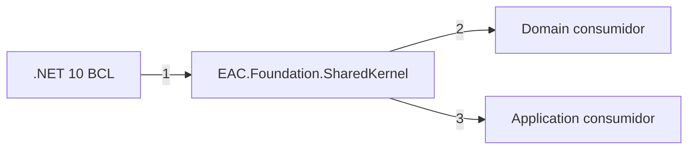

# Diseño de SharedKernel dentro de EAC.Foundation

> **Orden documental:** DOC-023 · **Etapa:** Foundation · [Índice maestro](../INDICE_DOCUMENTAL.md)

> Primer paquete diseñado durante F3. Este documento define su contrato público; no diseña todavía otros paquetes Foundation.

## 1. Propósito

`EAC.Foundation.SharedKernel` proporciona primitivas técnicas mínimas que pueden utilizar Domain y Application sin depender de infraestructura, transporte, persistencia ni una biblioteca de mediación.

El paquete debe ser pequeño, estable y difícil de cambiar. Una funcionalidad no entra por ser reutilizable en dos lugares: entra únicamente cuando expresa un concepto técnico común y no impone una arquitectura interna al consumidor.

## 2. Identidad

| Propiedad | Decisión |
|---|---|
| Package ID | `EAC.Foundation` |
| Target framework | `net10.0` |
| Nullable | habilitado |
| Implicit usings | habilitado |
| Dependencias externas | ninguna |
| Dependencias `EAC.*` | ninguna |
| Compatibilidad | SemVer |
| AOT y trimming | debe ser compatible |

## 3. Alcance de la versión 1.0.0

La primera versión publica solamente:

- `IError`, `Error` y `ErrorType`;
- `Result` y `Result<TValue>`;
- `IDomainEvent`.

No publica entidades base, agregados base ni repositorios. Las ayudas opcionales de modelado se encuentran en [`EAC.Foundation.Domain`](EAC_FOUNDATION_DOMAIN.md); una solución también puede modelar esos elementos con records, clases o tipos propios sin heredar de las bases ofrecidas.

## 4. API pública propuesta

Las firmas siguientes son el contrato objetivo. Los detalles internos pueden cambiar sin afectar consumidores.

### 4.1 ErrorType

```csharp
namespace EAC.Foundation.SharedKernel.Results;

public enum ErrorType
{
    Failure = 0,
    Validation = 1,
    NotFound = 2,
    Conflict = 3,
    Unauthorized = 4,
    Forbidden = 5,
    Unavailable = 6
}
```

`ErrorType` clasifica el error sin asignarle directamente un código HTTP. La traducción a HTTP, mensajería o telemetría corresponde a los adaptadores.

### 4.2 Error

```csharp
namespace EAC.Foundation.SharedKernel.Results;

public interface IError
{
    string Code { get; }
    string Description { get; }
    ErrorType Type { get; }
}

public sealed record Error : IError
{
    public string Code { get; }
    public string Description { get; }
    public ErrorType Type { get; }

    public Error(string code, string description, ErrorType type);

    public static Error Failure(string code, string description);
    public static Error Validation(string code, string description);
    public static Error NotFound(string code, string description);
    public static Error Conflict(string code, string description);
    public static Error Unauthorized(string code, string description);
    public static Error Forbidden(string code, string description);
    public static Error Unavailable(string code, string description);
}
```

Reglas:

- `Code` es estable, no localizado y apto para contratos y métricas.
- `Code` contiene entre 1 y 128 caracteres ASCII, comienza con una letra minúscula y utiliza segmentos alfanuméricos separados por un único `.`, `-` o `_`;
- `Code` no admite mayúsculas, espacios, caracteres no ASCII, separadores consecutivos ni separadores en los extremos;
- `Description` es segura para consumidores, pero no contiene trazas, secretos ni datos sensibles.
- `Description` no puede ser nula, vacía ni contener únicamente espacios;
- `Type` debe ser uno de los valores definidos por `ErrorType`;
- no se admite un diccionario libre de metadata en `1.0.0`;
- los errores especializados implementan `IError` en su paquete propietario;
- los errores de validación por campo se modelan en `EAC.Foundation.Application`, no aquí.

### 4.3 Result

```csharp
namespace EAC.Foundation.SharedKernel.Results;

public sealed class Result
{
    public bool IsSuccess { get; }
    public bool IsFailure { get; }
    public IError? Error { get; }

    public static Result Success();
    public static Result Failure(IError error);

    public TResult Match<TResult>(
        Func<TResult> onSuccess,
        Func<IError, TResult> onFailure);
}
```

Invariantes:

- un resultado exitoso no contiene error;
- un resultado fallido contiene exactamente un error;
- `Failure` rechaza `null`;
- no existe estado parcialmente inicializado;
- las excepciones se reservan para fallos inesperados o errores de programación.

### 4.4 Result de valor

```csharp
namespace EAC.Foundation.SharedKernel.Results;

public sealed class Result<TValue>
{
    public bool IsSuccess { get; }
    public bool IsFailure { get; }
    public TValue? Value { get; }
    public IError? Error { get; }

    public static Result<TValue> Success(TValue value);
    public static Result<TValue> Failure(IError error);

    public TResult Match<TResult>(
        Func<TValue, TResult> onSuccess,
        Func<IError, TResult> onFailure);
}
```

Invariantes adicionales:

- el éxito contiene un valor válido según la nulabilidad de `TValue`;
- acceder a `Value` no debe utilizarse como sustituto de comprobar `IsSuccess` o ejecutar `Match`;
- no se definen conversiones implícitas en `1.0.0`, evitando resultados creados accidentalmente.

### 4.5 IDomainEvent

```csharp
namespace EAC.Foundation.SharedKernel.Domain;

public interface IDomainEvent
{
    Guid EventId { get; }
    DateTimeOffset OccurredAtUtc { get; }
}
```

Reglas:

- cada evento de dominio concreto pertenece a la solución consumidora;
- el evento es inmutable;
- `EventId` identifica la instancia del evento;
- `OccurredAtUtc` representa cuándo ocurrió el hecho de negocio;
- correlation, causation, tenant, versión y metadata de transporte pertenecen al envelope de integración;
- `IDomainEvent` no depende de una librería de mediación ni obliga a heredar de una clase base.

## 5. Ejemplo mínimo de consumo

```csharp
public sealed record DocumentPublished(
    Guid EventId,
    DateTimeOffset OccurredAtUtc,
    Guid DocumentId) : IDomainEvent;

public Result<DocumentPublished> Publish()
{
    if (!CanBePublished())
    {
        return Result<DocumentPublished>.Failure(
            Error.Conflict("document.invalid-state", "The document cannot be published."));
    }

    var published = new DocumentPublished(Guid.NewGuid(), DateTimeOffset.UtcNow, Id);
    return Result<DocumentPublished>.Success(published);
}
```

El ejemplo ilustra la API, no impone que el agregado devuelva su evento ni que utilice directamente el reloj del sistema. Las soluciones que necesiten tiempo controlado usarán `TimeProvider` mediante Application.

## 6. Distribución de responsabilidades

| Concepto | Decisión | Paquete propietario o motivo |
|---|---|---|
| evento de dominio | incluir | interfaz mínima e inmutable |
| Commands, Queries y casos de uso | excluir | pertenecen a `EAC.Foundation.Application` |
| requests | excluir | pertenecen a Application |
| entidades, agregados y value objects | excluir | pertenecen a `EAC.Foundation.Domain` |
| especificaciones | aplazar | requieren una decisión específica de Application |
| repositorios y Unit of Work | excluir | sus contratos base pertenecen a `EAC.Foundation.Application` y sus implementaciones a persistencia |
| paginación | excluir | pertenece a Application/API |
| data shaping | excluir | introduce reflexión y contratos dinámicos |
| errores esperados | incluir | utilizar `Error`, `Result` y traducción en los bordes |
| ordenación y actualización parcial | excluir | pertenecen a API/Application según el contrato |
| utilidades funcionales | excluir | pertenecen al dominio de cada solución |

## 7. Estructura del proyecto

```text
EAC.Foundation/
└── SharedKernel/
├── Domain/
│   └── IDomainEvent.cs
├── Results/
│   ├── Error.cs
│   ├── ErrorType.cs
│   ├── IError.cs
│   ├── Result.cs
│   └── ResultOfT.cs
└── EAC.Foundation.csproj
```

No se crea una carpeta `Utils`. Cada tipo debe pertenecer a un concepto explícito.

## 8. Dependencias



### Orden explicado

1. Shared Kernel depende únicamente de la biblioteca base de .NET 10.
2. Un dominio consumidor puede utilizar `IDomainEvent` y resultados sin conocer infraestructura.
3. Application puede reutilizar resultados y errores para sus casos de uso.

Ningún paquete `EAC.*` puede ser dependencia de `EAC.Foundation.SharedKernel`.

## 9. Compatibilidad

Se consideran cambios incompatibles:

- eliminar o renombrar un miembro público;
- cambiar el significado de un `ErrorType`;
- cambiar el contrato mínimo de `IError`;
- cambiar invariantes de `Result`;
- añadir miembros obligatorios a `IDomainEvent`;
- cambiar nulabilidad pública;
- incorporar una dependencia externa que se filtre al consumidor.

Agregar un nuevo valor a `ErrorType` requiere analizar consumidores con `switch` exhaustivo y se documentará expresamente.

## 10. Pruebas requeridas

### Unitarias

- construcción válida e inválida de `Error`;
- invariantes de éxito y fallo;
- `Match` ejecuta una sola rama;
- preservación del valor genérico;
- igualdad de `Error`;
- rechazo de argumentos inválidos.

### Contrato público

- snapshot de API pública;
- nulabilidad compilada como error;
- ausencia de dependencias NuGet externas;
- ausencia de referencias a ASP.NET Core, EF Core y brokers;
- ejemplo consumidor compilable.

### Compatibilidad técnica

- build Release para `net10.0`;
- warnings tratados como errores;
- análisis de trimming;
- publicación determinista del paquete;
- Source Link, símbolos, SBOM y firma del artefacto.

## 11. Matriz de trazabilidad de reglas

Esta matriz aplica el
[estándar transversal de trazabilidad](https://github.com/eac-architecture/eac-engineering-governance/blob/develop/docs/standards/testing/RULE_TRACEABILITY_STANDARD.md).
`eng/capabilities.yml` es el inventario ejecutable de conformidad: cada regla
declarada allí aparece exactamente una vez en el diseño propietario y al menos
una prueba la identifica mediante `Trait("Rule", "<ID>")`.

| ID | Regla de diseño | Evidencia ejecutable primaria |
|---|---|---|
| `EAC-CONF-FOUND-001` | `Error` conserva clasificación, datos y semántica de igualdad estructural. | [`ErrorTests.cs`](../../tests/EAC.Foundation.UnitTests/ErrorTests.cs) |
| `EAC-CONF-FOUND-002` | `Error` rechaza códigos, descripciones y clasificaciones inválidos. | [`ErrorTests.cs`](../../tests/EAC.Foundation.UnitTests/ErrorTests.cs) |
| `EAC-CONF-FOUND-003` | `Result` representa exclusivamente éxito sin error o fallo con error. | [`ResultTests.cs`](../../tests/EAC.Foundation.UnitTests/ResultTests.cs) |
| `EAC-CONF-FOUND-004` | `Result<T>` conserva el valor de éxito o el error de fallo, incluida la nulabilidad declarada. | [`ResultOfTTests.cs`](../../tests/EAC.Foundation.UnitTests/ResultOfTTests.cs) |
| `EAC-CONF-FOUND-005` | `Match` ejecuta exactamente una rama y rechaza callbacks nulos. | [`ResultTests.cs`](../../tests/EAC.Foundation.UnitTests/ResultTests.cs), [`ResultOfTTests.cs`](../../tests/EAC.Foundation.UnitTests/ResultOfTTests.cs) |
| `EAC-CONF-FOUND-006` | La API pública de SharedKernel conserva únicamente los contratos aprobados. | [`PublicApiContractTests.cs`](../../tests/EAC.Foundation.ContractTests/PublicApiContractTests.cs), [`SharedKernelUsageTests.cs`](../../tests/EAC.Foundation.ContractTests/SharedKernelUsageTests.cs) |
| `EAC-CONF-FOUND-007` | El ensamblado conserva identidad, target, namespaces y dependencias aprobados. | [`AssemblyBoundaryTests.cs`](../../tests/EAC.Foundation.ArchitectureTests/AssemblyBoundaryTests.cs) |

## 12. Criterios de aceptación

El diseño queda cerrado cuando:

- se aprueban las tres primitivas públicas y sus firmas;
- no contiene tipos de Application, persistencia o transporte;
- no obliga a herencia en el modelo de dominio;
- todas las invariantes pueden probarse;
- el paquete no tiene dependencias externas;
- su API permite evolucionar Application sin modificar el núcleo.

## 13. Decisiones aplazadas

No se decidirán dentro de este paquete:

- contratos de Command, Query y casos de uso;
- errores de validación por campo;
- paginación;
- especificaciones;
- reloj y generación de identificadores;
- acumulación de eventos en agregados;
- envelopes de integración;
- repositorios y transacciones.

Cada punto se tratará cuando corresponda diseñar el paquete propietario.

La acumulación de eventos, entidades, agregados y value objects quedó asignada a [`EAC.Foundation.Domain`](EAC_FOUNDATION_DOMAIN.md).

## 14. Estado de implementación

El contrato quedó aprobado durante F3 e implementado en F4 dentro de `EAC.Foundation` `0.1.0-alpha.2`. Las reglas `EAC-CONF-FOUND-001` a `EAC-CONF-FOUND-007` disponen de pruebas unitarias, contractuales y arquitectónicas ejecutables. El gate de build genera paquete reproducible y símbolos para `net10.0`. La URL Source Link se verificará cuando el repositorio disponga de remoto; firma, SBOM y publicación se completarán en el gate de release de `1.0.0`. Son evidencias de release, no decisiones de diseño pendientes.

`EAC.Foundation.Domain` está validado dentro del mismo ensamblado y NuGet con
Entity, AggregateRoot y ValueObject. Su evidencia de cierre se mantiene como
PF-003 en el [plan maestro](https://github.com/eac-architecture/eac-engineering-governance/blob/main/docs/planning/PLAN_MAESTRO_DE_IMPLEMENTACION.md);
Application está validado como PF-004 y el siguiente incremento es PF-005.
