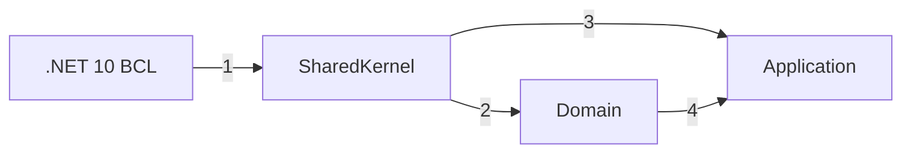

# Auditoría de cierre de Application

> **Orden documental:** DOC-069 · **Etapa:** Gobierno de plataforma · [Índice maestro](../INDICE_DOCUMENTAL.md)

> Evidencia integral para cerrar PF-004 antes de preparar la publicación estable de `EAC.Foundation`.

## 1. Propósito

Verificar que la capacidad Application de `EAC.Foundation` está implementada, documentada y protegida por gates ejecutables, sin trasladar decisiones pendientes a PF-005.

La auditoría cruza:

- API pública y restricciones genéricas;
- separación CQRS entre Command y Query;
- dependencias entre namespaces del mismo ensamblado;
- neutralidad frente a infraestructura, transporte y proveedores;
- documentación XML;
- manifest de capacidades;
- pruebas unitarias, contractuales y arquitectónicas;
- contenido del único paquete NuGet.

No valida implementaciones de dispatcher, persistencia o transporte. Esas responsabilidades pertenecen a sus productos y adaptadores propietarios.

## 2. Veredicto

| Área | Resultado |
|---|---|
| API pública | Cumple |
| CQRS y puertos de persistencia | Cumple |
| Dependencias permitidas | Cumple |
| Neutralidad tecnológica | Cumple |
| Documentación XML | Cumple |
| Manifest y trazabilidad | Cumple |
| Pruebas automatizadas | Cumple |
| Identidad física y empaquetado | Cumple |
| Cierre PF-004 | **Aprobado** |

Application queda validado en `EAC.Foundation` `0.1.0-alpha.17`. No se añadieron ensamblados, proyectos productivos ni paquetes secundarios.

## 3. Alcance físico auditado

La implementación contiene 21 tipos públicos distribuidos en ocho namespaces internos del mismo ensamblado:

| Namespace | Responsabilidad | Estado |
|---|---|---|
| `Application.Requests` | solicitud y ejecución base de casos de uso | Implementado |
| `Application.Commands` | Commands con y sin valor | Implementado |
| `Application.Queries` | Queries con respuesta tipada | Implementado |
| `Application.Dispatching` | despacho local abstracto | Implementado |
| `Application.Pipeline` | behaviors y continuación tipada | Implementado |
| `Application.Validation` | fallos, error, resultado y validator | Implementado |
| `Application.Pagination` | solicitud y página inmutables | Implementado |
| `Application.Persistence` | Repository, QueryService y commit local | Implementado |

La unidad física continúa siendo:

```text
eac-foundation
└── EAC.Foundation
    └── EAC.Foundation.dll
```

## 4. Dependencias verificadas



### Orden explicado

1. SharedKernel utiliza únicamente la BCL de .NET 10.
2. Domain utiliza el contrato mínimo de eventos de SharedKernel.
3. Application utiliza resultados y errores de SharedKernel.
4. El Repository de Application utiliza `IAggregateRoot` e `IEntity<TId>` de Domain para aplicar su límite en compilación.

El ensamblado no referencia paquetes externos. Application no expone tipos de ASP.NET Core, EF Core, MongoDB, Marten, Elasticsearch, Kafka, RabbitMQ, sesiones, `IQueryable` ni transporte.

## 5. Reglas de conformidad

| Regla | Evidencia en Foundation | Resultado |
|---|---|---|
| `EAC-CONF-APP-001` | contratos y pruebas de Request, Command, Query y Use Case | Cumple |
| `EAC-CONF-APP-002` | delegada a `EAC.Application.Runtime`, propietario del manifest de composición | No aplica a Foundation |
| `EAC-CONF-APP-003` | propagación de cancelación en casos de uso | Cumple |
| `EAC-CONF-APP-004` | invariantes y snapshot público de Validation | Cumple |
| `EAC-CONF-APP-005` | invariantes y contrato de paginación | Cumple |
| `EAC-CONF-APP-006` | total largo, snapshot y consistencia de página | Cumple |
| `EAC-CONF-APP-007` | Query Use Case base no expone Repository, Unit of Work ni CommitResult | Cumple |
| `EAC-CONF-APP-008` | superficie Application y puertos sin proveedores ni transporte | Cumple |
| `EAC-CONF-APP-009` | snapshot exacto de los 21 tipos públicos de Application | Cumple |
| `EAC-CONF-APP-010` | contrato del dispatcher local | Cumple |
| `EAC-CONF-APP-011` | contrato y ejecución del pipeline | Cumple |
| `EAC-CONF-APP-012` | límites CQRS y contratos de persistencia | Cumple |

`APP-002` no se omite: el manifest `eng/capabilities.yml` registra su delegación explícita. Foundation no contiene contenedor, registros ni implementaciones concretas de casos de uso y, por tanto, no puede comprobar unicidad de resolución sin asumir una responsabilidad de Runtime.

## 6. Correcciones realizadas durante la auditoría

| Hallazgo | Corrección |
|---|---|
| el snapshot público no estaba trazado como `APP-009` | se añadió el Trait correspondiente al gate existente |
| `APP-007` no tenía evidencia directa en Foundation | se añadió una prueba arquitectónica sobre el contrato base de Query Use Case |
| la neutralidad se comprobaba solo en Persistence | se añadió un gate sobre toda la superficie pública Application |
| el manifest no diferenciaba reglas cubiertas y delegadas | se incorporó el mapa de conformidad y propietario de `APP-002` |
| el diseño aún llamaba propuesta a la API implementada | se actualizó su estado |
| el grafo omitía la dependencia Application → Domain | se documentó la restricción de Repository hacia Aggregate Root identificado |
| compatibilidad aún mencionaba `SendAsync` | se alineó con `DispatchAsync` |
| pruebas requeridas omitían Persistence | se añadió su bloque de aceptación |

No fue necesario cambiar la API productiva de `alpha.16`; las correcciones fortalecen trazabilidad, gates y documentación.

## 7. Evidencia automatizada

| Evidencia | Resultado |
|---|---|
| Build Release | 0 errores, 0 advertencias |
| UnitTests | 138 aprobadas |
| ArchitectureTests | 7 aprobadas |
| ContractTests | 32 aprobadas |
| Total | **177 aprobadas, 0 fallidas, 0 omitidas** |
| documentación pública | XML obligatorio mediante `CS1591` |
| target | `net10.0` |
| paquetes productivos | un NuGet `EAC.Foundation` |
| ensamblados productivos en el NuGet | uno: `EAC.Foundation.dll` |
| SHA-256 `.nupkg` | `6146de6a082952f9db6f68ca8308d43e4d8b8929d469fd92f03e3e9b3aac3274` |
| SHA-256 `.snupkg` | `23ab239e4fc5c7de504245372f2a69ac4a7682ceee7516492149bd8b08b7ef47` |

## 8. Criterios de cierre

PF-004 se aprueba porque:

- toda la API diseñada existe en el mismo ensamblado;
- cada tipo público forma parte del snapshot contractual;
- Command y Query mantienen responsabilidades separadas;
- Repository solo admite Aggregate Roots identificados;
- QueryService concentra las lecturas;
- Unit of Work representa únicamente una confirmación local;
- la API no filtra proveedores ni transporte;
- toda superficie pública tiene documentación XML;
- el manifest refleja módulos implementados y reglas delegadas;
- CI produce evidencia repetible sin advertencias.

## 9. Siguiente paso autorizado

Se autoriza PF-005: preparación de la release estable del núcleo. Debe abordarse por bloques de release y no añadir capacidades funcionales nuevas a Application. Su alcance incluye gates G0-G8, compatibilidad pública, símbolos, Source Link, SBOM, firma y publicación controlada de `EAC.Foundation` `1.0.0`.

El seguimiento continúa en el [plan maestro](https://github.com/eac-architecture/eac-engineering-governance/blob/main/docs/planning/PLAN_MAESTRO_DE_IMPLEMENTACION.md).
