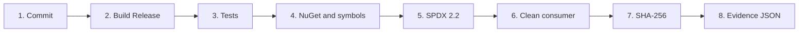

# Candidato de release de EAC.Foundation

> **Orden documental:** DOC-086 · **Etapa:** Operación de producto · [Índice](../INDICE_DOCUMENTAL.md)

## 1. Propósito

Generar un candidato NuGet verificable para los gates G5-G7 sin firmarlo ni
publicarlo. El candidato conserva la relación entre versión, commit, package,
símbolos y SBOM para que G8 pueda publicar posteriormente los mismos bytes.

## 2. Contrato

| Entrada | Regla |
|---|---|
| `VERSION` | fuente única; admite `<major>.<minor>.<patch>-alpha.N`, `-beta.N` o `-rc.N` durante la estabilización |
| `PACKAGE_VERSION` | comprobación opcional; si se proporciona debe coincidir exactamente con `VERSION` |
| `RELEASE_COMMIT` | commit inmutable; Tekton usa el resultado de checkout |
| configuración | siempre `Release` |
| herramienta SBOM | `Microsoft.Sbom.DotNetTool` `4.1.5`, fijada en `.config/dotnet-tools.json` |



### Orden explicado

1. Se registra el commit que identifica el código fuente.
2. El binario se compila una sola vez con la versión solicitada.
3. Las 177 pruebas actuales se ejecutan sin recompilar.
4. `pack.sh --no-build` genera `.nupkg` y `.snupkg` desde ese binario.
5. Microsoft SBOM Tool genera y valida un manifiesto SPDX 2.2.
6. Un proyecto temporal instala el NuGet desde una fuente local y ejecuta una
   API pública de Foundation.
7. Se calculan hashes SHA-256 del package, los símbolos y el SBOM.
8. La evidencia JSON enlaza todos los resultados con la versión y el commit.

## 3. Ejecución local

```bash
./scripts/build.sh
./scripts/test.sh --no-build
./scripts/release-candidate.sh
```

Los tres comandos leen la versión vigente desde `VERSION`. Para avanzar la
madurez se modifica ese único archivo en una revisión Git de `release/*`:

```text
0.1.0-alpha.19
0.1.0-beta.1
0.1.0-rc.1
```

## 4. Ejecución con Tekton

La instalación y el iniciador pertenecen a `eac-pipeline-catalog`:

```bash
./scripts/install.sh
./scripts/run-release-candidate.sh \
  https://github.com/eac-architecture/eac-foundation.git \
  main
```

La Pipeline `eac-nuget-release-candidate` utiliza la Service Account
`eac-release`, pero en este incremento no monta Secrets ni realiza llamadas de
publicación.

## 5. Salidas

```text
artifacts/
├── packages/
│   ├── EAC.Foundation.<version>.nupkg
│   └── EAC.Foundation.<version>.snupkg
├── sbom/
│   └── spdx_2.2/manifest.spdx.json
└── evidence/
    ├── checksums.sha256
    ├── release-evidence.json
    └── sbom-validation.json
```

Tekton expone como Results el commit, nombre y hash del package, nombre de los
símbolos, hash del SBOM y ruta relativa de la evidencia. Los archivos grandes
permanecen en el workspace y no se copian a Results.

## 6. Límites

- no publica en NuGet.org;
- no firma packages;
- no crea ni mueve tags Git;
- no cambia la versión declarada en el proyecto;
- no admite todavía una versión final sin sufijo;
- no calcula versiones desde ramas, fechas o números de ejecución;
- no recibe API keys;
- no recompila después de las pruebas.

Firma, procedencia y publicación pertenecen exclusivamente a REL-002/G8.
